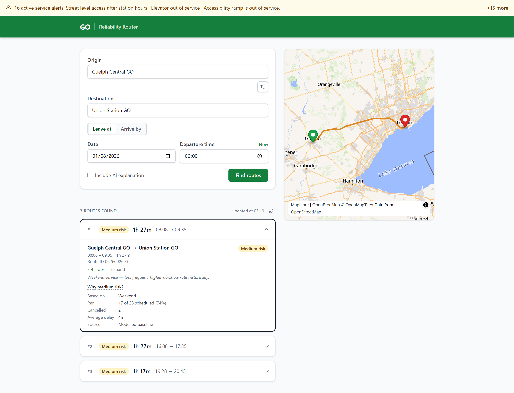

# GO Transit Reliability Router — Frontend

Web UI for the [GO Transit Reliability Router](https://github.com/dcmshi/transit_planner) backend. Surfaces reliability-first route planning for GO Transit buses between Toronto and Guelph — accounting for bus no-shows, service alerts, and risky transfers.



## Stack

| Concern | Choice |
|---|---|
| Framework | Next.js 16 (App Router) |
| Language | TypeScript |
| Package manager | bun |
| Styling | Tailwind CSS, semantic colour tokens (light/dark) |
| Data fetching | TanStack Query v5 |
| Type generation | openapi-typescript |
| Map | MapLibre GL JS + OpenFreeMap tiles |
| Polyline decoding | @mapbox/polyline |
| Testing | Vitest + Testing Library (jsdom) |
| E2E testing | Playwright (headless Chromium) |

## Prerequisites

- [bun](https://bun.sh) installed
- Backend running at `http://localhost:8000` — see [transit_planner](https://github.com/dcmshi/transit_planner)

## Setup

```bash
bun install
cp .env.example .env.local   # edit if backend runs on a different port
bun dev
```

Open [http://localhost:3000](http://localhost:3000).

## Regenerating API types

`src/types/api.ts` is generated from the backend's OpenAPI schema — never edit
it by hand. Run this whenever the backend schema changes, with the backend up:

```bash
bun run types:generate
```

The generator is pinned in `devDependencies`, so everyone regenerates with the
same version. Point it elsewhere by editing the URL in the `types:generate`
script.

## Environment variables

| Variable | Default | Description |
|---|---|---|
| `NEXT_PUBLIC_API_URL` | `http://localhost:8000` | Base URL for the backend API |

## Testing

```bash
bun run test          # run all tests once (vitest — plain `bun test` runs bun's own runner)
bun run test:watch    # watch mode
bun run test:e2e      # Playwright end-to-end suite (see prerequisites below)
```

### End-to-end tests

`bun run test:e2e` drives the real app in headless Chromium:

| Spec | Backend | What it covers |
|---|---|---|
| `route-planning.spec.ts` | live | Stop search, route planning, selection, persistence across reloads, empty state |
| `banners.spec.ts` | stubbed | Backend-down banner and the alerts banner — states the UI can't be driven into |
| `stop-search.spec.ts` | stubbed | A rate-limited stop lookup reports the failure and recovers on retry |
| `arrive-by.spec.ts` | live | Arrive-by returns only itineraries beating the deadline; missed-deadline empty state |
| `risk-basis.spec.ts` | live | The risk explainer opens from data already on the page, issuing no request |
| `accessibility.spec.ts` | fixtures | Measured touch targets and WCAG contrast ratios, in both colour schemes |
| `mobile-layout.spec.ts` | fixtures | 390×844 viewport: map placement between form and results, no horizontal overflow, header wrapping, map height |

#### The rate limit

The backend rate-limits: measured at roughly a 30-request bucket refilling a
few per second. A planning flow now costs three requests — two stop searches as
the user types, plus `/routes`. It used to cost eight: legs carried no
coordinates, so `useRoutePolyline` resolved each intermediate stop through its
own `/stops` search.

The suite does **not** retry through a 429. It fails immediately, naming the
limiter, so the condition stays visible rather than being masked:

```
Error: Stop lookup for "Union Station" failed: Too many requests to the
backend just now. Wait a moment and try again.
```

Staying under the limit is handled by spending the budget only where it buys
something. `route-planning.spec.ts` drives the real backend; the specs that
test the UI itself serve their data from `e2e/fixtures.ts`, which also makes
their assertions deterministic. `/health` and `/alerts` fire on every page load
and are stubbed everywhere except the spec that covers them. Workers are capped
at two so parallel tests don't burst past the bucket.

Prerequisites:

- Backend stack running with GTFS data ingested — `docker compose up` in
  [transit_planner](https://github.com/dcmshi/transit_planner)
- One-time browser download: `npx playwright install chromium`

The frontend dev server is started automatically (an already-running
`bun dev` on :3000 is reused). Not wired into CI — it needs the backend.

### Unit tests

277 tests across 35 files covering utility functions, hooks, and all major components:

| File | What it covers |
|---|---|
| `src/lib/format.test.ts` | `formatDuration`, `formatGtfsTime` (padding, past-midnight, malformed input), `formatDistance` |
| `src/lib/explanation.test.ts` | `isExplanationAvailable`, `parseRecommendedIndex` |
| `src/lib/groupLegs.test.ts` | consecutive same-trip leg merging |
| `src/lib/api.test.ts` | both 404 kinds, arrive_by encoding, explain flag, query encoding, timeout signal, `/alerts`, older-browser AbortSignal fallbacks |
| `src/lib/routeKey.test.ts` | stable route identity, duplicate disambiguation, reorder stability, what the key deliberately ignores |
| `src/lib/mapBounds.test.ts` | SW/NE corner ordering regardless of stop orientation |
| `src/components/RiskBadge.test.tsx` | colour class per risk level, neutral fallback for unknown labels |
| `src/components/ExplanationPanel.test.tsx` | available vs. Ollama-unavailable states |
| `src/components/HealthBanner.test.tsx` | all 5 health/data states |
| `src/components/AlertsBanner.test.tsx` | hidden / single / multi-alert states, headline dedupe, expand and collapse |
| `src/components/StopSearch.test.tsx` | dropdown threshold, keyboard nav, scroll-into-view, Escape/ArrowDown edge cases, unique ids, selection, parent-driven clear |
| `src/components/LoadingRoutes.test.tsx` | spinner and loading text derived from the request timeout |
| `src/components/RouteForm.test.tsx` | render, submit gating, payload shape, depart/arrive-by modes, explain flag, swap, "Now" reset, past-date validation |
| `src/components/RouteList.test.tsx` | empty state, route count, explanation panel and its pending state, header wrapping, expansion across a reorder |
| `src/components/RouteCard.test.tsx` | summary row and depart/arrive times, select vs. expand decoupling, selection styling, route-id demotion, touch targets |
| `src/components/ErrorBoundary.test.tsx` | fallback rendering and error logging |
| `src/hooks/useRoutePolyline.test.ts` | GeoJSON from leg coordinates, encoded-polyline decoding and lon/lat order, chord fallback, mixed coverage, malformed input |
| `src/hooks/useSavedStops.test.tsx` | load after hydration, StrictMode clobber regression, persistence, corrupt JSON |
| `src/hooks/useStops.test.tsx` | 300 ms debounce, minimum query length |
| `src/hooks/useHealth.test.ts` | poll interval per health state |
| `src/hooks/useRoutes.test.tsx` | explanation fetched separately and excluded from background refetch |
| `src/app/page.test.tsx` | persisted stops restored into form, submit wiring, selection reset and reorder survival, live explain toggle, error state and retry, mobile source order |
| `src/app/providers.test.tsx` | devtools excluded outside development |
| `src/app/globals.test.ts` | font variables applied, one shared focus treatment |
| `src/app/routeFallbacks.test.tsx` | route-level loading, error and not-found pages |
| `src/components/RouteMap.test.tsx` | responsive sizing, basemap failure fallback, screen-reader summary |
| `src/components/MapFrame.test.tsx` | placeholder matches the loaded map's frame |
| `src/components/icons.test.tsx` | icons are decorative and inherit colour |
| `src/lib/routeName.test.ts` | line designation vs. opaque route id |
| `src/lib/routeTimes.test.ts` | first departure to last arrival across leg kinds |
| `src/lib/routeSummary.test.ts` | screen-reader description of a route |
| `src/lib/apiError.test.ts` | timeout, 5xx, 4xx, unreachable and fallback messages |
| `src/lib/riskBasis.test.ts` | bucket and source labelling, float rounding, observed share, average delay, neutral prior |
| `src/components/RiskBasisPanel.test.tsx` | disclosure behaviour, counters shown, no request issued |
| `src/test/repo.test.ts` | README image links, generated-types script |

## Project structure

```
src/
  app/              # Next.js App Router pages and layout
  components/       # UI components (RouteCard, StopSearch, HealthBanner, …)
  hooks/            # TanStack Query hooks (useRoutes, useStops, useHealth, useRoutePolyline)
  lib/              # Pure utility functions and API client
  types/
    api.ts          # Auto-generated from backend OpenAPI schema — do not edit
  test/             # Vitest setup file
```

## Features

**v1 — Core UI**
- Stop search with 300 ms debounce
- Date and departure time picker (defaults to today / now)
- Route results with Low / Medium / High risk badges
- Leg-by-leg breakdown (trip and walk legs) with expand/collapse
- Transfer count and total walk distance per route
- Optional AI explanation via Ollama (`?explain=true`)
- Health banner when the backend graph is building or reliability data is missing

**v2 — Map**
- Side-by-side layout: form + results on the left, sticky map on the right
- Green origin marker and red destination marker update as stops are selected
- Map fits both stops in view; pans to a single stop when only one is selected
- Stacks vertically on narrow viewports

**v3 — Auto-refresh**
- Results silently re-fetch every 5 minutes while the page is open
- Returning to the tab triggers an immediate background refresh
- Route list stays visible during background fetches (no flash of loading state)
- "Updated at HH:MM" timestamp and a spinning refresh button in the results header

**v8 — Dark mode**
- Follows the operating system via `prefers-color-scheme`; no toggle, no flash, nothing persisted
- Colour lives in one semantic token set in `globals.css` rather than `dark:` on every utility — neutrals are a scale where low numbers are surfaces and high numbers are ink in both themes, accents are roles
- `color-scheme` is declared, so native date/time pickers, checkboxes and scrollbars follow too
- Contrast is measured in both schemes in `accessibility.spec.ts`, not assumed

**v7 — Arrive-by and risk transparency**
- "Leave at / Arrive by" toggle; arrive-by returns the latest departures that still make the deadline
- Empty state distinguishes "nothing arrives in time" from "no service between these stops"
- Every leg explains its risk score inline — history window, departures that ran, cancellations, average delay, and whether the score rests on observations or a modelled baseline
- Trip legs follow the real track, decoded from the backend's encoded polylines

**v4 — Route polylines**
- Clicking a route card selects it; the first route is auto-selected on load
- Selected route's legs are drawn on the map as straight-line polylines
- Trip legs coloured by risk (green / amber / red); walk legs dashed grey
- Intermediate transfer stop coordinates resolved on demand via `GET /stops` (cached)
- Blue ring highlights the selected card; green ring reserved for the recommended route

**v5 — Quality & accessibility**
- Date picker defaults to today's local date (fixed UTC off-by-one) and blocks past dates
- Stop search: keyboard navigation (↑ ↓ navigate, Enter selects, Escape closes), `role="combobox"`, `aria-controls`, `aria-activedescendant`
- Error boundary in root layout — unhandled render errors show a reload prompt instead of a blank page
- Last-used origin and destination persisted in `localStorage` (with quota-error guard) and restored on next visit
- `formatGtfsTime` pads both hours and minutes for robustness
- `LoadingRoutes` announces loading state to screen readers via `role="status"`
- `useHealth` continues polling at 5 min after healthy to detect subsequent degradation
- Route polyline held in a ref during pending queries — map no longer flashes empty between route selections

**v6 — Audit hardening**
- Persisted stops restore into the form (controlled `RouteForm` + `useSavedStops`), StrictMode-safe storage writes
- Route selection and React keys are identity-based — survive background refetches that reorder results
- AI explanation fetched once per journey, excluded from the 5-minute background refresh
- Select and expand are separate card actions; unique combobox ids; associated form labels
- Playwright e2e suite against the live backend

**v7 — Live service data**
- Service-alert banner (`GET /alerts`) — disruption headlines above the app
- Delayed legs show "Running ~N min late — expected HH:MM" from live GTFS-RT delays
- Editing a stop input clears the stale selection; date/time validated on submit
- Persisted stops validated on load; graceful API fallback for older browsers
